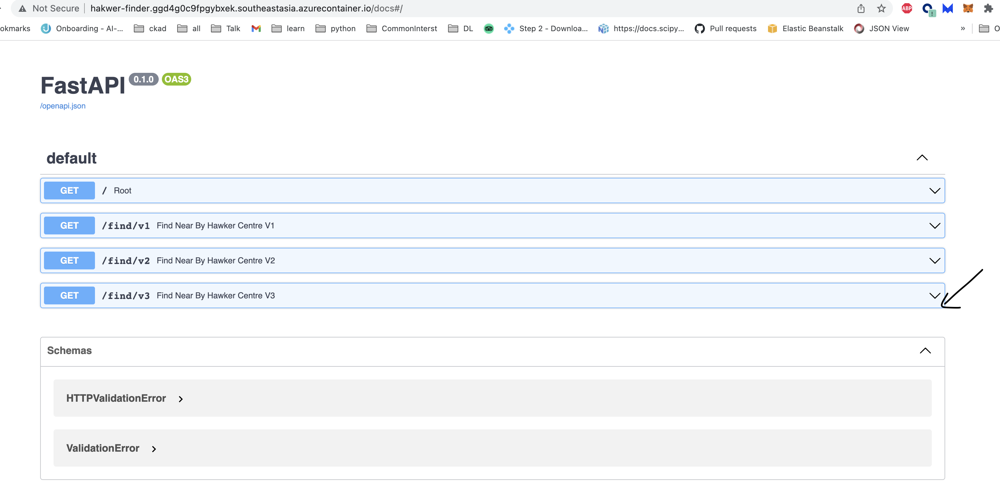
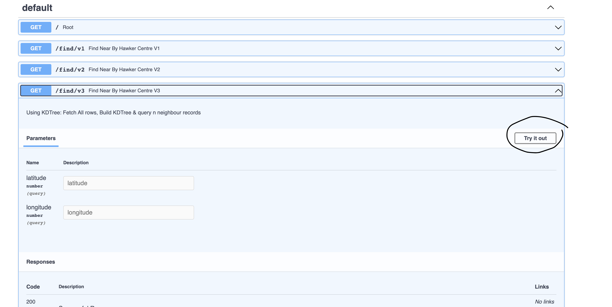
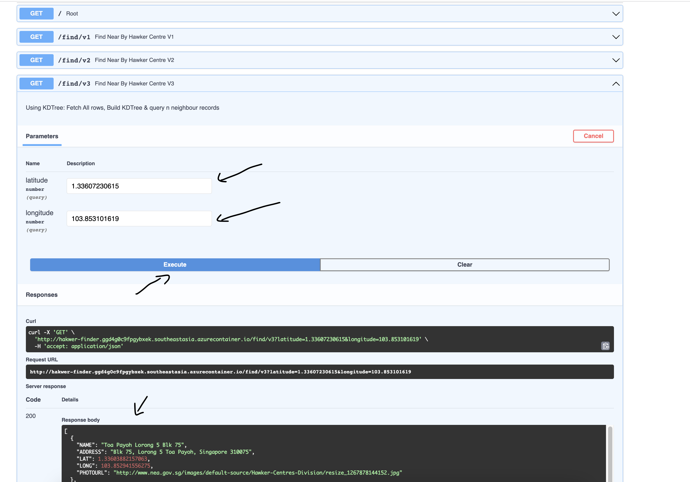

# hawker-centre-finder

## Dataloader script
- Input: pass a local geojson dataset filepath
- You can download the geojson file from here: [dataset link](https://data.gov.sg/dataset/hawker-centres?resource_id=8a6c2f75-5511-4e03-b8f2-23ce67d30b28)
- Output: It will load the geojson file and parse the content, push the data into database

Datastore chosen: MongoDB
|Table schema|
| -- |
|- Name |
|- PHOTOURL|
|- ADDRESS|
|- LAT|
|- LONG|
|- S2_ZONE_{id}|


## HawkerFinder API svc

### Dev
- API written in Python (FastAPI framework)
----
Package name | Usage 
 --- | ---
geopy | Help with compute gistance between two lat,long pairs
geopandas | read geojson file to pandas df
pymongo | Mongo db connector
s2cell | Google S2 cell library to convert lat,long to s2cell of given level
fastapi, uvicorn | Python microframework for building apis
dnspython | To resolve new mongo cluster srv dns urls
python-dotenv | To load env vars from .env file for local development
sklearn | To use KDTree implementation for finding nearest neighbours

***Note: Each version of the find api, will use a subset of the above mentioned packages.***


### Build
- API is build via docker
- Docker image is pushed to a public docker registry
- image: https://hub.docker.com/r/balanus/hawker-finder
- balanus/hawker-finder:latest
- To rebuild the image: `docker build -t balanus/hawker-finder .`

### Run
#### To run the image locally
- To run locally: `docker run -p 8000:80 balanus/hawker-finder:latest`
- access the api at: http://0.0.0.0:8000


### Deployment:
#### Deployed as a container in Azure Container Service
- http://hakwer-finder.ggd4g0c9fpgybxek.southeastasia.azurecontainer.io/docs#/

### Test:
- Try the different version of the find api as follows

-  
-  
-  

### Sample input
- url: http://hakwer-finder.ggd4g0c9fpgybxek.southeastasia.azurecontainer.io/find/v2?latitude=1.33607230615&longitude=103.853101619
- response: 
```[
  {
    "NAME": "Toa Payoh Lorong 5 Blk 75",
    "ADDRESS": "Blk 75, Lorong 5 Toa Payoh, Singapore 310075",
    "LAT": 1.33603882157063,
    "LONG": 103.852941556275,
    "PHOTOURL": "http://www.nea.gov.sg/images/default-source/Hawker-Centres-Division/resize_1267878144152.jpg",
    "dist": {
      "m": 18.194014892603647,
      "km": 0.01819401489260365,
      "miles": 0.011305236725400939
    }
  },
  {
    "NAME": "Toa Payoh Lorong 4 Blk 74 (Toa Payoh Vista Market)",
    "ADDRESS": "Blk 74, Lorong 4 Toa Payoh, Singapore 310074",
    "LAT": 1.33454816495637,
    "LONG": 103.851999137527,
    "PHOTOURL": "http://www.nea.gov.sg/images/default-source/Hawker-Centres-Division/resize_1262226848493.jpg",
    "dist": {
      "m": 208.46318862218743,
      "km": 0.20846318862218743,
      "miles": 0.12953302005176484
    }
  },
  {
    "NAME": "Toa Payoh Lorong 7 Blk 22 (Kim Keat Palm Market and Food Centre)",
    "ADDRESS": "Blk 22, Lorong 7 Toa Payoh, Singapore 310022",
    "LAT": 1.33523145909678,
    "LONG": 103.857036007166,
    "PHOTOURL": "http://www.nea.gov.sg/images/default-source/Hawker-Centres-Division/resize_1265168256123.jpg",
    "dist": {
      "m": 447.6186069964521,
      "km": 0.4476186069964521,
      "miles": 0.27813730749700005
    }
  },
  {
    "NAME": "Toa Payoh Lorong 4 Blk 93",
    "ADDRESS": "Blk 93, Lorong 4 Toa Payoh, Singapore 310093",
    "LAT": 1.3384747524617,
    "LONG": 103.849513484035,
    "PHOTOURL": "http://www.nea.gov.sg/images/default-source/Hawker-Centres-Division/resize_1262154305312.jpg",
    "dist": {
      "m": 479.61185728741066,
      "km": 0.4796118572874107,
      "miles": 0.29801699157384043
    }
  },
  {
    "NAME": "Toa Payoh Lorong 8 Blk 210",
    "ADDRESS": "Blk 210, Lorong 8 Toa Payoh, Singapore 310210",
    "LAT": 1.3402608349586,
    "LONG": 103.854395279214,
    "PHOTOURL": "http://www.nea.gov.sg/images/default-source/Hawker-Centres-Division/resize_1267876959422.jpg",
    "dist": {
      "m": 485.0070277020651,
      "km": 0.4850070277020651,
      "miles": 0.30136939504671784
    }
  }
]
```